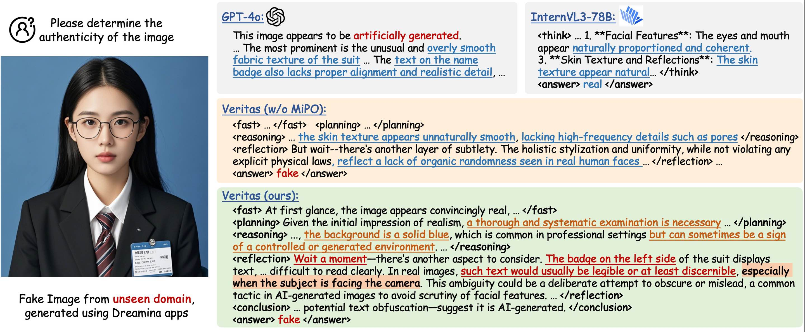

# Veritas: Generalizable Deepfake Detection via Pattern-Aware Reasoning

[Hao Tan](https://scholar.google.com/citations?hl=zh-CN&user=gPEjNFcAAAAJ), [Jun Lan](https://scholar.google.com/citations?user=nB_ntVkAAAAJ&hl=zh-CN&oi=ao), [Zichang Tan](https://scholar.google.com/citations?user=s29CDY8AAAAJ&hl=zh-CN&oi=ao), [Ajian Liu](https://scholar.google.com/citations?user=isWtY64AAAAJ&hl=zh-CN&oi=ao), [Chuanbiao Song](https://scholar.google.com/citations?user=el17bJoAAAAJ&hl=zh-CN&oi=ao), [Senyuan Shi](https://scholar.google.com/citations?hl=zh-CN&view_op=list_works&gmla=AH8HC4wQcWIFe0I2YTTgVx2ilBGZ6grGxjRYpFBecuoTSEVx9lR9HOLtUHRx8GC4TxUcdIuLtQy5-4fmCU8o0c78HB6KsI0&user=AT___f4AAAAJ), [Huijia Zhu](https://openreview.net/profile?id=~Huijia_Zhu1), [Weiqiang Wang](https://scholar.google.com/citations?hl=zh-CN&user=yZ5iffAAAAAJ&view_op=list_works&sortby=pubdate), [Jun Wan](http://www.cbsr.ia.ac.cn/users/jwan/), [Zhen Lei](http://www.cbsr.ia.ac.cn/users/zlei/)

MAIS, Institute of Automation, Chinese Academy of Sciences & Ant Group

In this work, we introduce:

> 📍**HydraFake Dataset**: A deepfake detection dataset that simulates real-world challenges with rigorous training and evaluation protocol.
>
> 📍**Veritas Model**: A deep reasoning model achieving remarkable generalization on OOD forgeries, capable of providing transparent and human-aligned decision process.

The dataset, model and code will be released here.

## 📨 Abstract

Deepfake detection remains a formidable challenge due to the complex and evolving nature of fake content in real-world scenarios. However, existing academic benchmarks suffer from **severe discrepancies from industrial practice**, typically featuring homogeneous training sources and low-quality testing images, which hinders the practical deployments of current detectors.
To mitigate this gap, we introduce **HydraFake**, a dataset that simulates real-world challenges with hierarchical generalization testing. Specifically, HydraFake involves diversified deepfake techniques and in-the-wild forgeries, along with rigorous training and evaluation protocol, covering unseen model architectures, emerging forgery techniques and novel data domains.
Building on this resource, we propose **Veritas**, a multi-modal large language model (MLLM) based deepfake detector. Different from vanilla chain-of-thought (CoT), we introduce ***pattern-aware reasoning*** that involves critical reasoning patterns such as "planning" and "self-reflection'' to emulate human forensic process. We further propose a two-stage training pipeline to seamlessly internalize such deepfake reasoning capacities into current MLLMs. Experiments on HydraFake dataset reveal that although previous detectors show great generalization on cross-model scenarios, they fall short on unseen forgeries and data domains. Our Veritas achieves significant gains across different OOD scenarios, and is capable of delivering *transparent* and *faithful* detection outputs.

## 🛡️ HydraFake Dataset

📍 **Overview:**

    

(a) We carefully collect and reimplement advanced deepfake techniques to construct our HydraFake dataset. Real images are collected from 8 datasets. Fake images are from classic datasets, high-quality public datasets and our self-constructed deepfake data. (b) We introduce a rigorous and hierarchical evaluation protocol. Training data contains abundant samples but limited forgery types. Evaluations are split into four distinct levels. (c) Illustration of the subsets in different evaluation splits. (d) The performance of prevailing detectors on our HydraFake dataset. **Most detectors shows strong generalization on Cross-Model setting but poor ability on Cross-Forgery and Cross-Domain scenarios.**

📍 **Statistics:**

    

HydraFake contains 52K images in total for evaluation, with 14K in-domain testing, 11K cross-model testing, 12K cross-forgery testing and 15K cross-domain testing.

For advanced deepfakes, we reproduced and crawled 10K deepfake data from 10 advanced generators. Besides traditional deepfake techniques, HydraFake dataset contains Face Restoration, Face Relighting, Face Personalization, Generative Face Swapping and deepfakes from Visual AutoRegressive models (VAR). To simulate real-world challenges, we also crawled 1K deepfake images from social media, which include practical deepfakes generated from commercial apps, including GPT-4o, Dreamina and Hailuo AI.

## 🛰️ Method

📍 We introduce a pattern-aware reasoning framework, including three basic thinking patterns (*fast judgement*, *reasoning*, *conclusion*) and two advanced patterns (*planning* and *self-reflection*).

📍 Two-stage training pipeline:

(1) **Pattern-guided Cold-Start** (SFT + MiPO): Internalize thinking patterns and align reasoning process

(2) **Pattern-aware Exploration** (P-GRPO): Scale up effective patterns, improve reflection quality.

    

📍 Our cold-start model serves as a strong reasoning foundation for deepfake detection. The community can add **custom data** (from diverse domains) with our P-GRPO to get more powerful reasoning models.

## Qualitative Results

InternVL3-78B gets incorrect answer. GPT-4o and our model trained without the proposed MiPO both fail to provide precise explanation. In contrast, our model gives transparent and faithful decision process:

    

More cases can be found in our paper.
