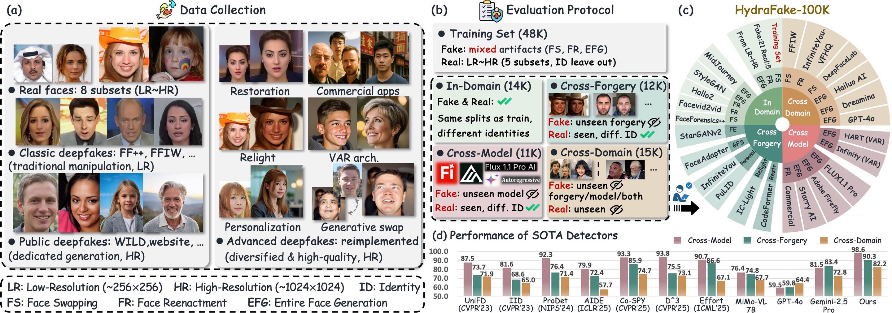
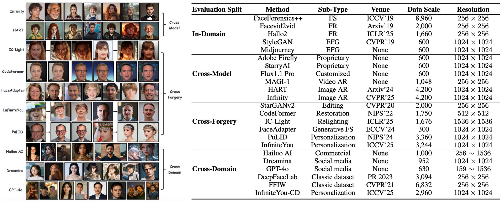
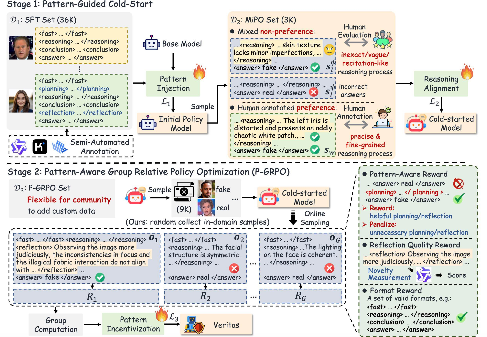

# Veritas: Generalizable Deepfake Detection via Pattern-Aware Reasoning

[Hao Tan](https://scholar.google.com/citations?hl=zh-CN&user=gPEjNFcAAAAJ), [Jun Lan](https://scholar.google.com/citations?user=nB_ntVkAAAAJ&hl=zh-CN&oi=ao), [Zichang Tan](https://scholar.google.com/citations?user=s29CDY8AAAAJ&hl=zh-CN&oi=ao), [Ajian Liu](https://scholar.google.com/citations?user=isWtY64AAAAJ&hl=zh-CN&oi=ao), [Chuanbiao Song](https://scholar.google.com/citations?user=el17bJoAAAAJ&hl=zh-CN&oi=ao), [Senyuan Shi](https://scholar.google.com/citations?hl=zh-CN&view_op=list_works&gmla=AH8HC4wQcWIFe0I2YTTgVx2ilBGZ6grGxjRYpFBecuoTSEVx9lR9HOLtUHRx8GC4TxUcdIuLtQy5-4fmCU8o0c78HB6KsI0&user=AT___f4AAAAJ), [Huijia Zhu](https://openreview.net/profile?id=~Huijia_Zhu1), [Weiqiang Wang](https://scholar.google.com/citations?hl=zh-CN&user=yZ5iffAAAAAJ&view_op=list_works&sortby=pubdate), [Jun Wan](http://www.cbsr.ia.ac.cn/users/jwan/), [Zhen Lei](http://www.cbsr.ia.ac.cn/users/zlei/)

MAIS, Institute of Automation, Chinese Academy of Sciences & Ant Group

In this work, we introduce:

> 📍**HydraFake Dataset**: A deepfake detection dataset with rigorous training and evaluation protocol.
>
> 📍**Veritas Model**: A reasoning model achieving remarkable generalization on OOD forgeries, capable of providing transparent and human-aligned decision process.

The dataset, model and code will be released here.


## 📨 Abstract

Deepfake detection remains a formidable challenge due to the complex and evolving nature of fake content in real-world scenarios. However, existing academic benchmarks suffer from **severe discrepancies from industrial practice**, typically featuring homogeneous training sources and low-quality testing images, which hinders the practical deployments of current detectors.
To mitigate this gap, we introduce **HydraFake**, a dataset that simulates real-world challenges with hierarchical generalization testing. Specifically, HydraFake involves diversified deepfake techniques and in-the-wild forgeries, along with rigorous training and evaluation protocol, covering unseen model architectures, emerging forgery techniques and novel data domains.
Building on this resource, we propose **Veritas**, a multi-modal large language model (MLLM) based deepfake detector. Different from vanilla chain-of-thought (CoT), we introduce ***pattern-aware reasoning*** that involves critical reasoning patterns such as "planning" and "self-reflection'' to emulate human forensic process. We further propose a two-stage training pipeline to seamlessly internalize such deepfake reasoning capacities into current MLLMs. Experiments on HydraFake dataset reveal that although previous detectors show great generalization on cross-model scenarios, they fall short on unseen forgeries and data domains. Our Veritas achieves significant gains across different OOD scenarios, and is capable of delivering *transparent* and *faithful* detection outputs.


## News
- 🔥 `2025.9.17` We release the inference code for MLLMs and small vision models.
- 🔥 `2025.9.17` We release the [HydraFake](https://docs.google.com/forms/d/e/1FAIpQLSf0uMg4thR4YcsNwpRqdWtc4K4z-txy24ileQPaUQzRIuMDYg/viewform?usp=header) dataset (train/val/test). Please fill the form to get access.

## Installation
```bash
conda create -n veritas python=3.10
conda activate veritas

# Install the dependencies
pip install -e .
```


## ⌛ Test your model on HydraFake Dataset
### 1. Data Preparation
Download the [HydraFake](https://docs.google.com/forms/d/e/1FAIpQLSf0uMg4thR4YcsNwpRqdWtc4K4z-txy24ileQPaUQzRIuMDYg/viewform?usp=header) dataset and the json files. Put the json files under `./datasets`. The data structure should be like:
```
hydrafake
├── test                # testing images
|   ├── AdobeFirefly
|   |   ├── 0_real
|   |   │   └── *.png
|   |   ├── 1_fake
|   |   │   └── *.png
|   |── ...
├── val                 # validation images
|   ├── real
|   |   └── *.png
|   ├── fake
|   |   └── *.png
├── train               # training images
|   ├── fake
|   |   ├── FS
|   |   |   ├── blendface
|   |   |   │   └── *.png
|   |   |   ├── ...
|   |   ├── FR
|   |   |   ├── Aniportrait
|   |   |   │   └── *.png
|   |   |   ├── ...
|   |   ├── EFG
|   |   |   ├── Dall-E1
|   |   |   │   └── *.png
|   |   |   ├── ...
├── jsons
|   ├── test
|   |   ├── id
|   |   │   └── *.json 
|   |   ├── cm
|   |   │   └── *.json 
|   |   ├── cf
|   |   │   └── *.json 
|   |   ├── cd
|   |   │   └── *.json 
|   ├── val
|   |   └── *.json 
|   ├── train
|   |   ├── fake
|   |   |   ├── FS
|   |   |   │   └── *.json 
|   |   |   ├── FR
|   |   |   │   └── *.json 
|   |   |   ├── EFG
|   |   |   │   └── *.json 
|   |   ├── real
|   |   │   └── *.json 
```
You can also put the dataset in other places, then you should change the json file path in `./swift/llm/dataset/dataset/data_utils.py` and the image path in the json files.


### 2. Test your MLLMs
#### 2.1 Inference with **ms-swift**
Run inference on HydraFake:
```bash
sh self_scripts/infer/infer_hydrafake.sh /path/to/your/model
```
Inference on a specific subset:
```bash
swift infer \
    --val_dataset cd_gpt4o \
    --model /path/to/your/model \
    --infer_backend pt \
    --max_model_len 8192 \
    --max_new_tokens 2048 \
    --dataset_num_proc 16 \
    --max_batch_size 8 \
    --metric self_acc_tags
```

#### 2.2 Inference with **vLLM**
Step1: Deploy your model:
```bash
sh self_scripts/deploy/deploy_model.sh /path/to/your/model  # models/Qwen2.5-VL-7B-Instruct
```
Step2: Run inference (put your model path in `self_scripts/infer/infer_vllm.py`):
```bash
sh self_scripts/infer/infer_hydrafake_vllm.sh 
```

### 3. Test your vision models
We provide a script based on [DeepfakeBench](https://github.com/SCLBD/DeepfakeBench).
```bash
# Effort for example
python DeepfakeBench/training/test.py \
--detector_cfg DeepfakeBench/training/config/detector/effort.yaml \   
--dataset_cfg DeepfakeBench/training/config/dataset/hydrafake.yaml \
--weights_path /path/to/your/model
```

## Deployment
We recommend using `vLLM` for model deployment:
```bash
sh self_scripts/deploy/deploy_model.sh /path/to/your/model
```
Inference on a single image:
```bash
python self_scripts/infer/infer_vllm_single.py \
--image_path /path/to/your/image
```


## 🛡️ HydraFake Dataset

📍 **Overview:**

<p align="center">
    
</p>


(a) We carefully collect and reimplement advanced deepfake techniques to construct our HydraFake dataset. Real images are collected from 8 datasets. Fake images are from classic datasets, high-quality public datasets and our self-constructed deepfake data. (b) We introduce a rigorous and hierarchical evaluation protocol. Training data contains abundant samples but limited forgery types. Evaluations are split into four distinct levels. (c) Illustration of the subsets in different evaluation splits. (d) The performance of prevailing detectors on our HydraFake dataset. **Most detectors shows strong generalization on Cross-Model setting but poor ability on Cross-Forgery and Cross-Domain scenarios.**

📍 **Statistics:**

<p align="center">
    
</p>

HydraFake contains 52K images in total for evaluation, with 14K in-domain testing, 11K cross-model testing, 12K cross-forgery testing and 15K cross-domain testing.


## 🛰️ Method

📍 We introduce a pattern-aware reasoning framework, including three basic thinking patterns (*fast judgement*, *reasoning*, *conclusion*) and two advanced patterns (*planning* and *self-reflection*).

📍 Two-stage training pipeline:

(1) **Pattern-guided Cold-Start** (SFT + MiPO): Internalize thinking patterns and align reasoning process

(2) **Pattern-aware Exploration** (P-GRPO): Scale up effective patterns, improve reflection quality.

<p align="center">
    
</p>


## Citation
If you find our work useful, please cite our paper:
```
@article{tan2025veritas,
  title={Veritas: Generalizable Deepfake Detection via Pattern-Aware Reasoning},
  author={Tan, Hao and Lan, Jun and Tan, Zichang and Liu, Ajian and Song, Chuanbiao and Shi, Senyuan and Zhu, Huijia and Wang, Weiqiang and Wan, Jun and Lei, Zhen},
  journal={arXiv preprint arXiv:2508.21048},
  year={2025}
}
```

## License
This repo is released under the [Apache 2.0 License](https://github.com/EricTan7/Veritas/blob/main/LICENSE).

## Acknowledgements
This repo benefits from [ms-swift](https://github.com/modelscope/ms-swift) and [DeepfakeBench](https://github.com/SCLBD/DeepfakeBench). Thanks for their great works!